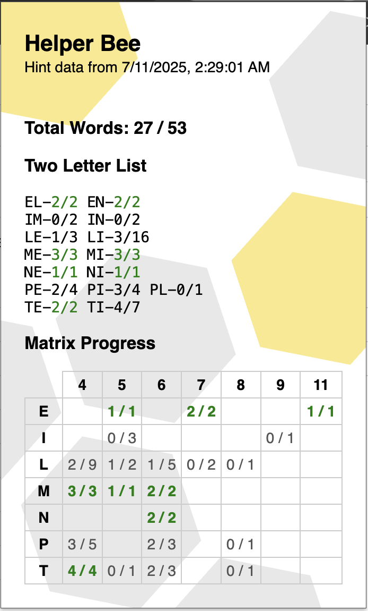

## 🐝 Helper Bee

An NYT Spelling Bee progress tracking Chrome Extension. Based on the official hints provided by the game. 

### How to use
- Install and open the extension.
- Visit the daily hints page:
   [Spelling Bee Forum](https://www.nytimes.com/crosswords/spelling-bee-forum.html)  
   (The extension will automatically extract the day's clues.)
- Go back to the puzzle:
   [Play Spelling Bee](https://www.nytimes.com/puzzles/spelling-bee)
- Open the extension popup to view your progress:
   - ✅ Two-letter prefix clue tracking
   - ✅ Matrix of found words by length and starting letter

### TODO

- Ensure only today's hints are stored
- Add support for archived/previous puzzles
